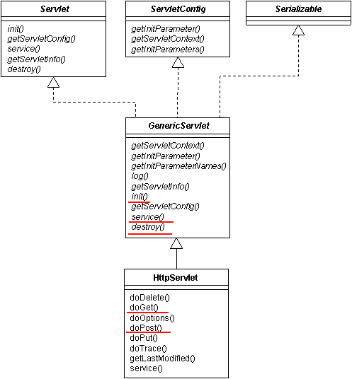

Servlet 파일을 처음 생성하고 나면 해당 클래스가 **HttpServlet**이라는 추상클래스를 상속받고 있는 것을 확인할 수 있다. **HttpServlet** 클래스를 타고 들어가보면 또 다른 **GenericServlet**이라는 추상클래스를 다시 상속받고 있다.

이처럼 하나의 서블릿 클래스는 아래 첨부된 UML에서 보이는 것과 같이 여러 추상클래스들을 상속받고 있기 때문에 사용자의 요청(Request) 과 응답(Response)을 처리할 수 있는 다양한 메소드들을 갖추고 있다.

### doGet() 과 doPost()

특히 HttpServlet 클래스의 doGet()과 doPost()를 구현하여 Get방식과 Post 방식으로 분기하여 사용자의 요청과 웹서버의 응답을 처리할 수 있다.

앞으로 대부분의 작업들을 위 메소드안에서 진행하게 될 것 같다.