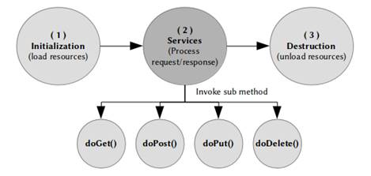

사용자로부터 요청이 들어오거나 웹서버가 응답을 보내올 때 서블릿의 역할은 시작되고 생명주기에 따라 요청을 처리하게 된다.

서블릿의 생명주기는 크게 세가지 단계로 나뉜다.

------

### 생성 단계

요청이 있는 경우 서블릿 객체가 생성되고 **init()** 메소드를 호출한다. 주로 공통적으로 처리되어야 하는 작업들이 위치한다.

일반적으로 웹컨테이너 (WAS)는 서블릿 요청을 받으면 해당 서블릿이 메모리에 올라와 있는지 확인하고 없는 경우에만 메모리에 서블릿을 올리고 init() 메소드를 실행한다. 이미 올라와 있는 경우 곧바로 서비스 단계로 넘어간다.

따라서 매 요청마다 서블릿이 새로 생성되는 것을 막아 시간도 줄이고 좀 더 효율적인 자원관리가 가능해진다. 

### 서비스 단계

서비스 단계에서는 요청을 처리할 수 있도록 **service()** 메소드를 호출한다. service() 메소드는 다시 요청 방식이 GET인지 POST인지에 따라 **doGet()** 메소드와 **doPost()** 메소드를 호출하게 된다. 

이후 요청이 있을 때마다 두 메소드안에서 개발자가 의도한 작업들을 수행하게 된다.

### 소멸 단계

웹컨테이너가 종료되거나 해당 서블릿 클래스가 새로 갱신되는 경우 소멸단계를 거치면서 **destroy()** 메소드가 호출된다. 자원해제와 같은 작업들이 주로 위치한다.

### @PostConstruct 와 @PreDestroy

추가적으로 위에서 명시된 세가지 단계 외에 선처리 및 후처리 작업이 필요한 경우 선택적으로 사용될 수 있다.

생성 단계 이전에 수행되어야 하는 선처리 작업이 있는 경우 일반 메소드에 **@PostConstruct** 어노테이션을 붙여서 사용하거나 소멸 단계 이후 후처리 작업이 있는 경우 마찬가지로 메소드에 **@PreDestroy** 어노테이션을 붙여서 사용할 수 있다.

> @PostConstruct => init() => service();doGet();doPost() => destroy() => @PreDestroy 순으로 실행된다.

