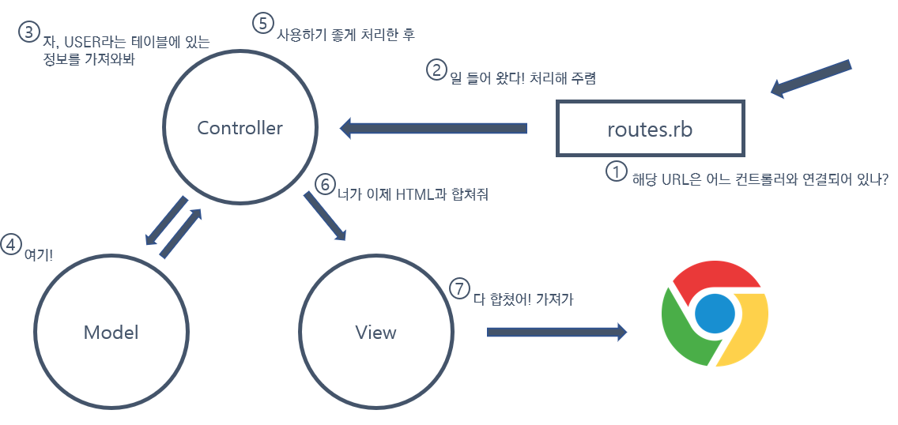

**Ruby on Rails (RoR)**는 Ruby 프로그래밍 언어로 이루어진 오픈소스 웹 프레임워크로써, 강력하고 탄탄한 웹 어플리케이션을 빠르게 개발할 수 있도록 도와준다.

**Rails**는 새로운 웹 어플리케이션을 개발할 때 어떤 것이 필요한지 파악하는 역할을 하며 개발을 편리하게 도와준다. 결과적으로 이를 통해 코드를 적게 쓰면서 동시에 더 많은 일을 처리할 수 있게 된다.

Rails에서 MVC 아키텍쳐가 어떻게 적용이 되고 동작하는지 정리해보았다.

## MVC 아키텍쳐

   

MVC는 Model과 View와 Controller를 지칭하는 용어이다.

**모델(Model)**은 비즈니스 로직을 다루고 데이터 및 데이터베이스에 대한 작업을 한다.

**뷰(View)**는 사용자의 요청에 따른 결과물이 표현되는 부분으로써 화면에 표출되는 방식에 대한 로직과 데이터를 다룬다. 레일즈에서는 데이터 표현에 관련된 루비 코드가 삽입되어 있는 HTML 파일(.erb)을 지칭하게 된다.

**컨트롤러(Controller)**는 모델과 뷰를 연결시켜주고 사용자의 입력을 받아 모델을 조작하는 등, 데이터의 흐름을 제어하는 역할을 한다. 즉 무엇을 해야 하는지 진두지휘한다!

사용자가 요청을 보내게 되면 서버내에서 이렇게 MVC 각각의 파트들이 서로 상호작용하여 일련의 과정을 거친 후 나온 HTML/CSS/JS 포맷의 파일을 브라우저에게 전달하게 되는 것이다.

Rails의 MVC 아키텍쳐가 동작하는 일련의 과정을 도식화하여 표현하면 다음과 같다.

> References
>
> *   https://youtu.be/IfRxX222PA4
> *   https://www.inflearn.com/course/ruby-coin/

