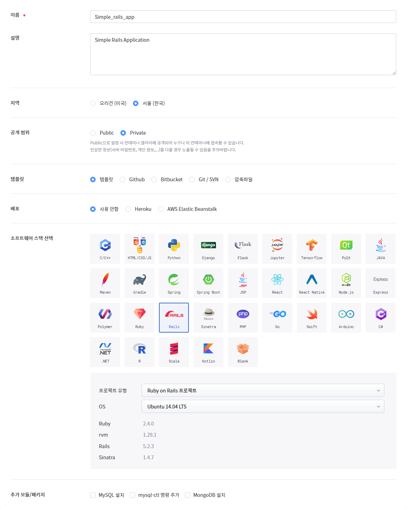
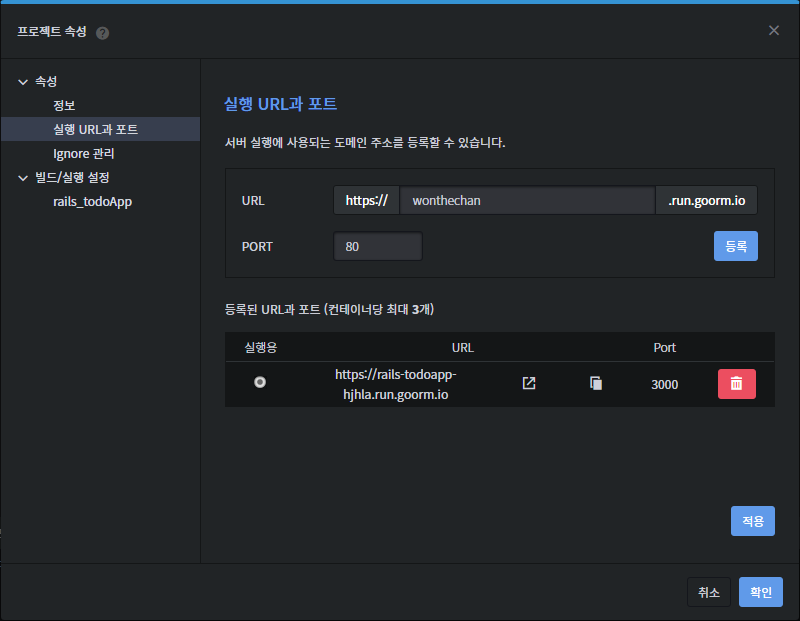

구름 IDE를 이용해서 빠르게 레일즈 컨테이너를 생성하는 법과 초기 설정법에 대해 정리해 보았다.

## 컨테이너 생성

위와 같이 체크하고 컨테이너 생성을 진행하면 3 ~ 5분 정도의 시간이 소요된다.

## 접속 URL 및 포트 설정

컨테이너 실행 후 상단 네비게이션 바에서 프로젝트 - 속성을 클릭해서 들어가면 다음과 같은 창이 뜬다.

먼저 밑에 이미 추가 되어 있던 등록정보는 휴지통 버튼을 눌러 삭제 해준다.

그리고나서 URL 칸에는 자신이 원하는 주소를 채워 넣고 **PORT**란에는 반드시 **80번**을 적어주어야 웹으로 접속할 수 있게 된다.

마지막으로 적용 버튼을 누르면 이후 [설정 이름].run.goorm.io로 접속이 가능해진다.