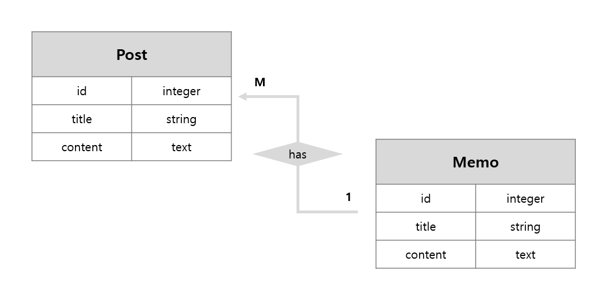

위처럼 하나의 Post가 여러개의 Memo를 가지는 One-to-Many Association을 만들어보려고 API를 비롯한 여러 문서들을 뒤져보았으나 레일즈 버전 차이때문인지 계속 실패하는 문제가 발생..

계속 헤매다 결국 작동하는 방법을 찾아냈고 그 과정을 아래에 정리해 보았다.


**참고: 레일즈 버전 5.2.3 에서 진행 되었음** 

## One-to-many Association

가장 먼저 Post 모델을 생성

```ruby
rails g model Post title:string content:text
```


그 다음 Many side에 해당하는 Memo 모델을 생성한다.

```ruby
rails g model Memo post:references title:string content:text
```

> 여기 **post:reference**  부분에서 Post의 id값을 참조하는 외래키 설정을 Memo 모델에 자동으로 해주게 된다.


변경사항 적용을 위해 마이그레이션을 진행한다.

```ruby
rake db:migrate
```


마이그레이션이 끝나면 추가적으로 프로젝트의 config/models 디렉토리 내에 존재하는 post.rb와 memo.rb 파일을 수정해주어야 한다.

*config/models/post.rb*

```ruby
has_many :memos, :dependent => :destroy
```

> 위와 같은 코드를 해당 파일의 클래스내에 넣어 준다. 이때 memo가 아닌 memo**s** 임을 주의하자. (복수형)

> delete on cascade 옵션을 추가해주기 위해 **:dependent => :destroy** 를 명시해주었다. (선택사항)


*config/models/memo.rb*

```ruby
belongs_to :post
```

> 마찬가지로 위의 코드를 해당 파일의 클래스에 넣어 준다.


이제 다음 명령어를 통해 1번 id를 가진 post를 참조하는 memo를 생성할 수 있다.

```ruby
@memo = Post.find(1).memos.create(:title => 'memoTitle', :content => 'memoContent')
```


또는 해당 post를 참조하는 모든 memo를 불러오거나 삭제하고 싶은 경우 다음과 같이 쓸 수 있다.

```ruby
@post = Post.find(1) # id값이 1인 Post를 불러옴
@post.memos # @post가 가진 모든 메모를 컬렉션 형태로 리턴한다.

@post.memos.size # @post가 가진 모든 메모의 개수를 리턴
@post.memos.clear # @post가 가진 모든 메모를 삭제
```


이외에 더 자세한 사항들은 아래 API 링크를 참고하자!

 https://rubykr.github.io/rails_guides/association_basics.html#has_many-association-reference 


> References
>
> *     https://www.sitepoint.com/brush-up-your-knowledge-of-rails-associations/ 
> *      https://nolboo.kim/blog/2015/05/23/rails-codecademy-3/ 